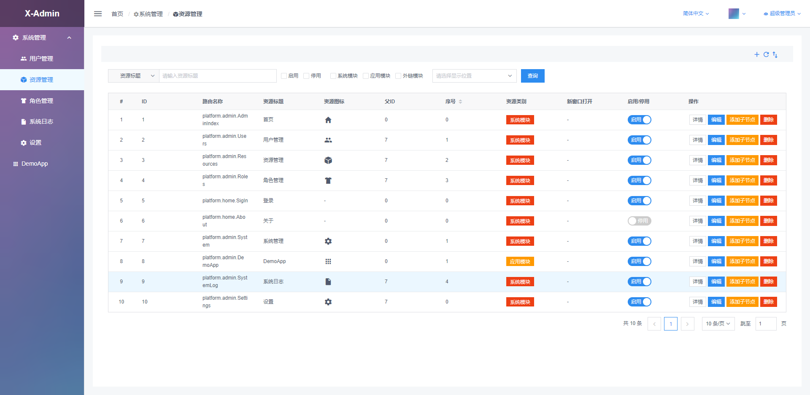

# X-Admin-Generator-Vue

基于Vue的后台管理平台脚手架

## Start 
```
 // clone repo
 git clone https://github.com/OXOYO/X-Admin-Generator-Vue.git
 // install dependencies
 npm install
 // start dev server
 npm run serve
 // build for production
 npm run build
```

## 账号

超级管理员：root 123123

管理员：admin 123123

## 配套API

[X-Admin-API-Generator-Koa](https://github.com/OXOYO/X-Admin-API-Generator-Koa)

## 特点

- [x] 基于RBAC的管理系统，已实现用户管理、资源管理、角色管理、日志查询。
- [x] 同构，Vue + Koa。
- [x] 前后端模块化，各功能模块高度解耦，独立开发。
- [x] 前后端国际化。
- [x] 接口RestFul。

## 预览

[online](http://oxoyo.co/X-Admin-Generator-Vue/)

账号：root 123123





## TODO

v2.x
- [x] TODO示例模块开发
- [ ] 基于v2.x开发Blog系统